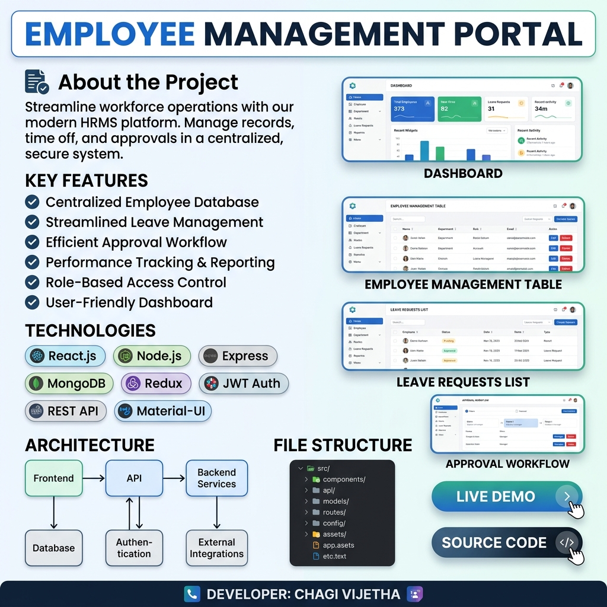

# EMPLOYEE MANAGEMENT PORTAL
> **A Role-based SAPUI5 Application for Managing Employees, Requests, Approvals & Reports**



---

## 👤 About the Project

**Employee Management Portal** is a responsive SAPUI5 application built using standard Model-View-Controller (MVC) architecture. It helps organizations manage employees, departments, designations, leave requests, and administrative approvals efficiently with a clean, premium, and modern user interface styled in Fiori Horizon.

---

## ⭐ Key Features

* **✔️ User Authentication (Login)**: Secure session validation with customized role routing.
* **✔️ Role-Based Access**: Specialized views and administrative clearances tailored for **Admin**, **Manager**, and **Employee** roles.
* **✔️ Dashboard with Statistics & Charts**: Rich summary statistics and real-time visualization widgets.
* **✔️ Employee Management (CRUD)**: Roster administration, new employee additions, and drill-down record profiles.
* **✔️ Department & Designation Management**: Department hierarchies, manager assignments, and operational budgets.
* **✔️ Leave Request & Approval Workflow**: Dynamic calendars, personal leave balances, and Manager-approval queues.
* **✔️ Search, Filter, Sort & Pagination**: Advanced client-side search and grouping options.
* **✔️ Data Validation & Message Handling**: Clean input error messaging and standard Fiori message popovers.
* **✔️ Responsive UI**: Seamless visual layout adjustments for Desktop, Tablet, and Mobile devices.

---

## 🛠️ Technologies Used

<div style="display: flex; flex-wrap: wrap; gap: 8px; margin-bottom: 20px;">
  <span style="background-color:#3182ce; color:white; padding:6px 12px; border-radius:20px; font-size:12px; font-weight:600; font-family:sans-serif;">SAPUI5</span>
  <span style="background-color:#3182ce; color:white; padding:6px 12px; border-radius:20px; font-size:12px; font-weight:600; font-family:sans-serif;">JSONModel</span>
  <span style="background-color:#3182ce; color:white; padding:6px 12px; border-radius:20px; font-size:12px; font-weight:600; font-family:sans-serif;">MVC</span>
  <span style="background-color:#3182ce; color:white; padding:6px 12px; border-radius:20px; font-size:12px; font-weight:600; font-family:sans-serif;">Routing</span>
  <span style="background-color:#3182ce; color:white; padding:6px 12px; border-radius:20px; font-size:12px; font-weight:600; font-family:sans-serif;">XML Views</span>
  <span style="background-color:#3182ce; color:white; padding:6px 12px; border-radius:20px; font-size:12px; font-weight:600; font-family:sans-serif;">JavaScript</span>
  <span style="background-color:#3182ce; color:white; padding:6px 12px; border-radius:20px; font-size:12px; font-weight:600; font-family:sans-serif;">OData (Mock)</span>
  <span style="background-color:#3182ce; color:white; padding:6px 12px; border-radius:20px; font-size:12px; font-weight:600; font-family:sans-serif;">Fragment</span>
  <span style="background-color:#3182ce; color:white; padding:6px 12px; border-radius:20px; font-size:12px; font-weight:600; font-family:sans-serif;">Formatter</span>
  <span style="background-color:#3182ce; color:white; padding:6px 12px; border-radius:20px; font-size:12px; font-weight:600; font-family:sans-serif;">Git & GitHub</span>
  <span style="background-color:#3182ce; color:white; padding:6px 12px; border-radius:20px; font-size:12px; font-weight:600; font-family:sans-serif;">HTML5</span>
  <span style="background-color:#3182ce; color:white; padding:6px 12px; border-radius:20px; font-size:12px; font-weight:600; font-family:sans-serif;">CSS3</span>
</div>

---

## 📐 Application Architecture

The architecture maintains standard data binds using service managers, keeping views declarative and controllers lightweight:

```
┌─────────────┐       ┌─────────────┐       ┌─────────────┐
│    View     │ ◄───► │ Controller  │ ◄───► │    Model    │
│    (XML)    │       │(JavaScript) │       │(JSON/OData) │
└─────────────┘       └──────┬──────┘       └─────────────┘
                             │
                             ▼
                      ┌─────────────┐
                      │   Router    │
                      │(Manifest)   │
                      └─────────────┘
```

---

## 📁 Project Structure

```
webapp/
├── controller/
│   ├── App.controller.js           # Root setup
│   ├── BaseController.js           # Reusable utils
│   ├── Home.controller.js          # Core portal navigation
│   ├── Login.controller.js         # Security logic
│   └── Analytics.controller.js     # Chart dashboard control
├── view/
│   ├── App.view.xml
│   ├── Home.view.xml
│   ├── Login.view.xml
│   └── Analytics.view.xml          # Grid charts XML
├── fragment/
│   ├── EmployeeDialog.fragment.xml  # Creation overlays
│   └── DepartmentDialog.fragment.xml
├── service/
│   ├── ExportService.js            # Spreadsheet & PDF exports
│   ├── APIService.js               # Promisified REST layer with local fallback
│   ├── ODataService.js             # v2 Batch model binder
│   └── mockData.json               # Sandbox database
├── Component.js                    # Core app initializer
├── manifest.json                   # Routes & models settings
└── index.html                      # Bootstrap root
```

---

## 🚀 Live Demo & Repository

* **🌐 Live Web Application**: [https://chagivijetha.github.io/Employee-Management-Portal/](https://chagivijetha.github.io/Employee-Management-Portal/)
* **📁 GitHub Source Code**: [https://github.com/chagivijetha/Employee-Management-Portal](https://github.com/chagivijetha/Employee-Management-Portal)

---

## ⚙️ Development & Local Run

### Prerequisites
* **Node.js** (v14 or higher)
* **NPM**

### Setup Sandbox
1. **Clone the code**:
   ```bash
   git clone https://github.com/chagivijetha/Employee-Management-Portal.git
   cd Employee-Management-Portal
   ```
2. **Install dependencies**:
   ```bash
   npm install
   ```
3. **Start the local server**:
   ```bash
   npm start
   ```
4. **Login Credentials**:

   | Role | Username | Password |
   |------|----------|----------|
   | **Admin** | `admin` | `password` |
   | **Manager** | `manager` | `password` |
   | **Employee** | `employee` | `password` |

---

<details>
<summary><b>🛠️ Advanced Features & Services Details (Click to Expand)</b></summary>

### 1. Robust Failover API Client (`APIService.js`)
If local development environments lack active live endpoints, the `APIService` intercepts the failure and pulls directly from the local JSON sandbox:
```javascript
_makeRequest: function (sMethod, sPath, oData) {
    var self = this;
    return new Promise(function (resolve, reject) {
        fetch(self._sBaseUrl + sPath, { method: sMethod })
            .then(function(res) {
                if (!res.ok) return self._loadMockDataFallback(sPath);
                return res.json();
            })
            .then(resolve)
            .catch(function() {
                self._loadMockDataFallback(sPath).then(resolve).catch(reject);
            });
    });
}
```

### 2. Client-Side Spreadsheet compiler (`ExportService.js`)
Builds spreadsheets synchronously on the main UI thread to prevent multi-thread serialization failures in JSON arrays:
```javascript
exportToExcel: function (aData, aColumns, sFileName) {
    return new Promise(function (resolve, reject) {
        sap.ui.require(["sap/ui/export/Spreadsheet"], function (Spreadsheet) {
            var oSettings = {
                workbook: { columns: aColumns },
                dataSource: aData,
                fileName: sFileName,
                worker: false // Direct sync build
            };
            var oSheet = new Spreadsheet(oSettings);
            oSheet.build().then(resolve).catch(reject).finally(() => oSheet.destroy());
        });
    });
}
```

### 3. VizFrame Premium Visual Customizations
Chart property configurations customized directly inside `Analytics.controller.js` to override default visualizations:
```javascript
oVizFrame.setVizProperties({
    plotArea: {
        dataLabel: { visible: true },
        colorPalette: ["#3498db", "#2ecc71", "#e74c3c", "#f1c40f"]
    },
    title: { visible: false },
    legend: { visible: true }
});
```

</details>

---

## 📬 Contact & Developer Profile

* **👤 Developer**: Chagi Vijetha
* **📧 Email**: chagivijetha@gmail.com
* **💼 LinkedIn**: [linkedin.com/in/chagivijetha](https://linkedin.com/in/chagivijetha)
* **📅 Last Updated**: May 2024
